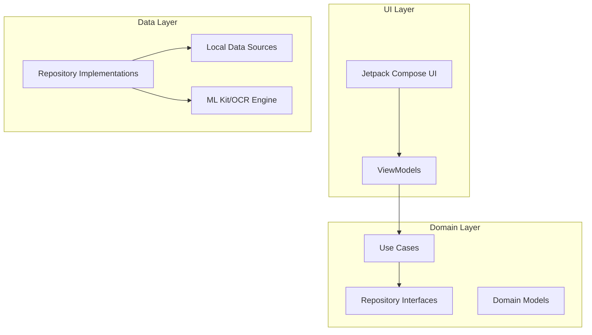
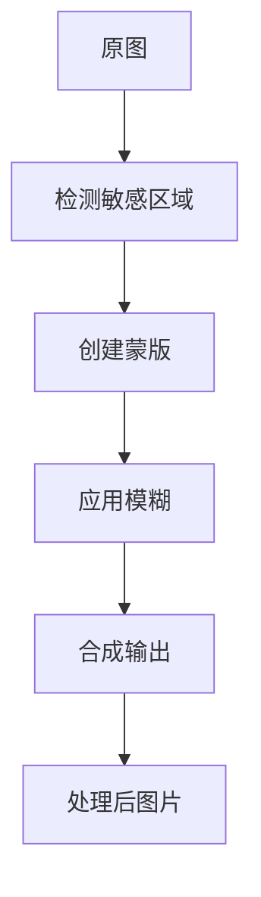
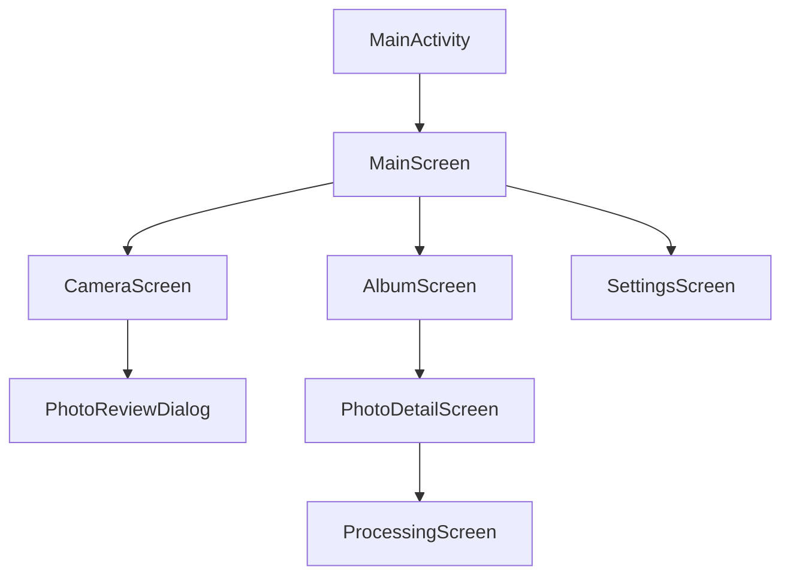
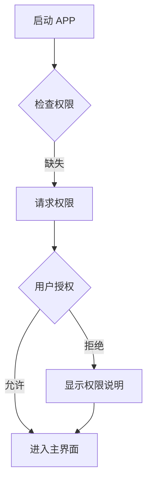

# 防泄密照相机 APP 技术设计文档

## 1. 项目概述

### 1.1 基本信息

| 项目 | 值 |
|------|-----|
| 项目名称 | PrivacyCamera (防泄密照相机) |
| 包名 | com.privacycamera.app |
| 最低 SDK | API 28 (Android 9) |
| 目标 SDK | API 34 (Android 14) |
| 开发语言 | Kotlin 1.9.x |
| UI 框架 | Jetpack Compose |

### 1.2 核心功能概述

防泄密照相机 APP 通过 AI 技术自动识别照片中的敏感信息（GPS、身份证号、银行卡号、密码等），并提供模糊处理功能，防止敏感信息泄露。

---

## 2. 技术架构

### 2.1 整体架构



### 2.2 模块划分

| 模块 | 职责 |
|------|------|
| `app` | 主应用模块，包含 MainActivity 和导航 |
| `:feature:camera` | 相机拍照功能模块 |
| `:feature:album` | 相册和隐私相册功能模块 |
| `:feature:settings` | 设置功能模块 |
| `:domain` | 领域层，包含业务逻辑和模型 |
| `:data:repository` | 数据层，Repository 实现 |
| `:data:ml` | ML 引擎，OCR 和敏感信息识别 |
| `:core:security` | 安全加密模块 |
| `:core:ui` | 通用 UI 组件 |

### 2.3 技术栈

| 类别 | 技术选型 | 说明 |
|------|---------|------|
| 语言 | Kotlin 1.9.22 | 现代 Android 开发语言 |
| UI | Jetpack Compose 1.5.x | 声明式 UI |
| 架构 | MVVM + Clean Architecture | 清晰的分层架构 |
| DI | Hilt 2.48 | 依赖注入 |
| 异步 | Kotlin Coroutines + Flow | 异步编程 |
| 相机 | CameraX 1.3.x | 官方相机库 |
| OCR | ML Kit Text Recognition 16.0.x | Google 文字识别 |
| 加密 | Android Keystore + AES-256 | 安全加密 |
| 存储 | Room 2.6.x | 本地数据库 |
| 图片 | Coil 2.5.x | 图片加载库 |

---

## 3. 功能模块设计

### 3.1 相机模块 (feature:camera)

#### 3.1.1 功能描述

负责拍照、预览、闪光灯控制、摄像头切换等功能。

#### 3.1.2 界面结构

```
CameraScreen
├── CameraPreview (CameraX 预览)
├── TopBar
│   ├── FlashButton (闪光灯控制)
│   └── SwitchCameraButton (切换摄像头)
├── BottomBar
│   ├── GalleryButton (打开相册)
│   ├── CaptureButton (拍照按钮)
│   └── SettingsButton (设置)
└── SensitiveOverlay (敏感信息高亮遮罩)
```

#### 3.1.3 关键类

| 类名 | 职责 |
|------|------|
| `CameraViewModel` | 相机业务逻辑 |
| `CameraScreen` | 相机主界面 |
| `SensitiveInfoOverlay` | 敏感区域高亮组件 |
| `CameraManager` | CameraX 封装管理 |

#### 3.1.4 状态定义

```kotlin
data class CameraUiState(
    val isLoading: Boolean = false,
    val flashMode: FlashMode = FlashMode.AUTO,
    val isFrontCamera: Boolean = false,
    val detectedSensitiveInfo: List<SensitiveInfo> = emptyList(),
    val capturedPhotoUri: Uri? = null,
    val error: String? = null
)
```

---

### 3.2 敏感信息识别模块 (data:ml)

#### 3.2.1 功能描述

使用 ML Kit 进行 OCR 文字识别，检测照片中的敏感信息。

#### 3.2.2 敏感信息检测策略

| 敏感类型 | 正则表达式/规则 |
|---------|---------------|
| 中国身份证号 | `\b[1-9]\d{5}(19|20)\d{2}(0[1-9]|1[0-2])(0[1-9]|[12]\d|3[01])\d{3}[\dXx]\b` |
| 银行卡号 | `\b\d{16,19}\b` (结合 Luhn 校验) |
| 手机号 | `\b1[3-9]\d{9}\b` |
| GPS 坐标 | EXIF 数据解析 |
| 邮箱 | `\b[\w.-]+@[\w.-]+\.\w+\b` |
| 地址关键词 | 包含省/市/区/路/号等关键词 |

#### 3.2.3 关键类

| 类名 | 职责 |
|------|------|
| `SensitiveInfoDetector` | 敏感信息检测器 |
| `TextRecognitionEngine` | OCR 文字识别封装 |
| `ExifMetadataReader` | EXIF 元数据读取 |
| `SensitiveInfoType` | 敏感信息类型枚举 |

---

### 3.3 相册模块 (feature:album)

#### 3.3.1 功能描述

普通相册选择照片，隐私相册管理加密照片。

#### 3.3.2 界面结构

```
AlbumScreen
├── NormalAlbumTab
│   ├── PhotoGrid (照片网格)
│   └── EmptyState (空状态)
├── PrivacyAlbumTab
│   ├── PasswordInput (密码输入)
│   ├── PhotoGrid (照片网格)
│   └── EmptyState (空状态)
└── PhotoDetailScreen
    ├── PhotoView (照片查看)
    ├── ProcessButton (处理按钮)
    └── ShareButton (分享按钮)
```

#### 3.3.3 关键类

| 类名 | 职责 |
|------|------|
| `AlbumViewModel` | 相册业务逻辑 |
| `PrivacyAlbumViewModel` | 隐私相册业务逻辑 |
| `PhotoRepository` | 照片数据仓库 |
| `EncryptedPhotoStorage` | 加密照片存储 |

---

### 3.4 处理模块

#### 3.4.1 功能描述

对照片中的敏感区域进行模糊处理。

#### 3.4.2 模糊算法

| 模糊级别 | 算法 | 参数 |
|---------|------|------|
| 轻度 | 高斯模糊 | radius = 10 |
| 中度 | 高斯模糊 | radius = 25 |
| 重度 | 高斯模糊 | radius = 50 |

#### 3.4.3 处理流程



---

### 3.5 安全模块 (core:security)

#### 3.5.1 功能描述

应用密码管理和照片加密存储。

#### 3.5.2 加密策略

| 数据 | 加密方式 |
|------|---------|
| 应用密码 | PBKDF2 哈希存储 |
| 照片文件 | AES-256-GCM |
| 密钥存储 | Android Keystore |

#### 3.5.3 关键类

| 类名 | 职责 |
|------|------|
| `SecurityManager` | 安全管理器 |
| `PasswordManager` | 密码验证 |
| `EncryptionManager` | 加密/解密 |
| `KeystoreManager` | 密钥管理 |

---

## 4. 数据模型

### 4.1 领域模型

```kotlin
data class SensitiveInfo(
    val type: SensitiveType,
    val boundingBox: Rect,
    val content: String,
    val confidence: Float
)

enum class SensitiveType {
    GPS_LOCATION,
    ID_CARD,
    BANK_CARD,
    PHONE_NUMBER,
    EMAIL,
    PASSWORD,
    ADDRESS
}

data class ProcessedPhoto(
    val id: String,
    val originalUri: String,
    val processedUri: String,
    val sensitiveInfoList: List<SensitiveInfo>,
    val processedAt: Long,
    val isFromPrivacyAlbum: Boolean
)

data class AppSettings(
    val autoDetectEnabled: Boolean = true,
    val defaultProcessLevel: BlurLevel = BlurLevel.MEDIUM,
    val isPasswordSet: Boolean = false
)
```

### 4.2 数据库 Schema (Room)

```kotlin
@Entity(tableName = "processed_photos")
data class ProcessedPhotoEntity(
    @PrimaryKey val id: String,
    val originalUri: String,
    val processedUri: String,
    val sensitiveTypes: String, // JSON array
    val processedAt: Long,
    val isFromPrivacyAlbum: Boolean
)

@Entity(tableName = "app_settings")
data class AppSettingsEntity(
    @PrimaryKey val id: Int = 1,
    val autoDetectEnabled: Boolean = true,
    val defaultProcessLevel: String = "MEDIUM",
    val passwordHash: String? = null,
    val passwordSalt: String? = null
)
```

---

## 5. 导航结构



### 5.1 导航路由

| 路由 | 屏幕 | 参数 |
|------|------|------|
| `/` | MainScreen | - |
| `/camera` | CameraScreen | - |
| `/album` | AlbumScreen | tab (normal/privacy) |
| `/album/photo/{id}` | PhotoDetailScreen | photoId |
| `/album/photo/{id}/process` | ProcessingScreen | photoId |
| `/settings` | SettingsScreen | - |

---

## 6. 权限请求

### 6.1 运行时权限

| 权限 | 请求时机 | 说明 |
|------|---------|------|
| CAMERA | 首次拍照前 | 必须 |
| READ_MEDIA_IMAGES | Android 13+，选择照片前 | 必须 |
| READ_EXTERNAL_STORAGE | Android 9-12，选择照片前 | 必须（部分权限）|

### 6.2 权限请求流程



---

## 7. 错误处理

### 7.1 错误类型

| 错误类型 | 用户提示 | 处理方式 |
|---------|---------|---------|
| 相机初始化失败 | "相机无法启动，请检查是否被其他应用占用" | 返回重试 |
| OCR 识别失败 | "文字识别失败，请重试" | 使用本地缓存 |
| 存储空间不足 | "存储空间不足，请清理后重试" | 引导清理 |
| 加密失败 | "数据保护失败，请重试" | 重试或降级 |
| 密码错误 | "密码错误，请重试" | 提示剩余次数 |

---

## 8. 项目结构

```
app/
├── src/main/
│   ├── java/com/privacycamera/app/
│   │   ├── PrivacyCameraApp.kt
│   │   ├── MainActivity.kt
│   │   └── di/
│   │       └── AppModule.kt
│   ├── java/com/privacycamera/feature/
│   │   ├── camera/
│   │   ├── album/
│   │   └── settings/
│   ├── java/com/privacycamera/domain/
│   │   ├── model/
│   │   ├── repository/
│   │   └── usecase/
│   ├── java/com/privacycamera/data/
│   │   ├── repository/
│   │   ├── local/
│   │   ├── ml/
│   │   └── security/
│   └── java/com/privacycamera/core/
│       ├── ui/
│       └── util/
└── src/main/res/
```

---

## 9. 依赖版本

```kotlin
// Kotlin
kotlin = "1.9.22"

// Compose
compose-bom = "2024.02.00"
compose-compiler = "1.5.8"

// AndroidX
core-ktx = "1.12.0"
activity-compose = "1.8.2"
lifecycle-runtime-compose = "2.7.0"
navigation-compose = "2.7.7"

// Hilt
hilt = "2.48"
hilt-navigation-compose = "1.1.0"

// CameraX
camerax = "1.3.1"

// ML Kit
mlkit-text-recognition = "16.0.0"

// Room
room = "2.6.1"

// Coil
coil = "2.5.0"

// Accompanist
accompanist-permissions = "0.34.0"
```

---

## 10. 测试策略

### 10.1 单元测试

- ViewModel 业务逻辑测试
- Repository 数据层测试
- 敏感信息检测逻辑测试
- 加密/解密功能测试

### 10.2 UI 测试

- 关键用户流程自动化测试
- 屏幕旋转和配置变更测试

### 10.3 集成测试

- 相机拍摄流程测试
- 照片处理完整流程测试
